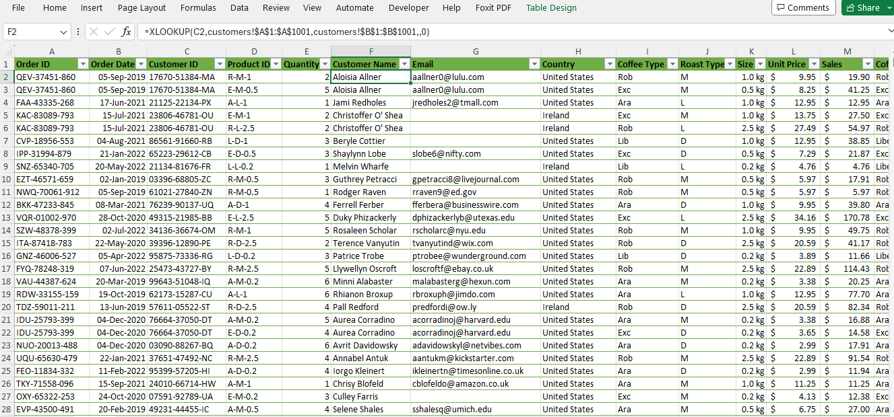
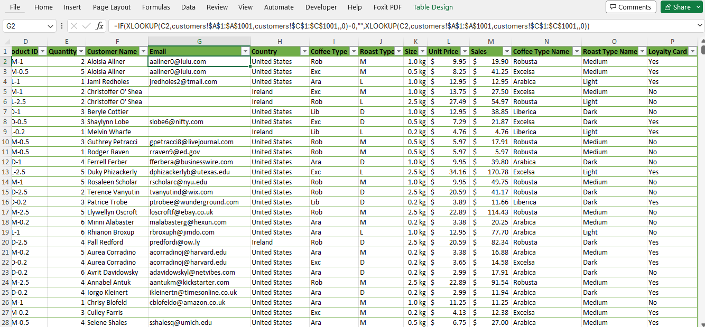
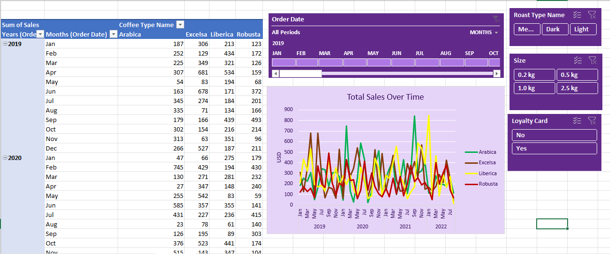
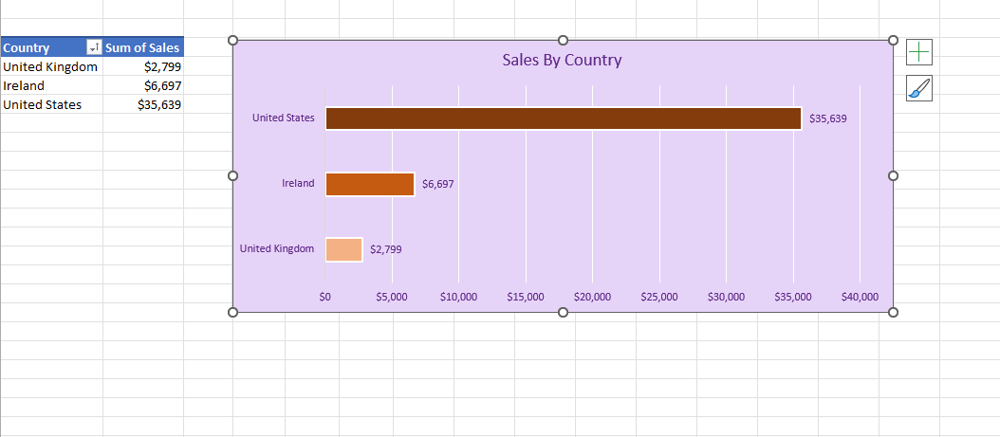
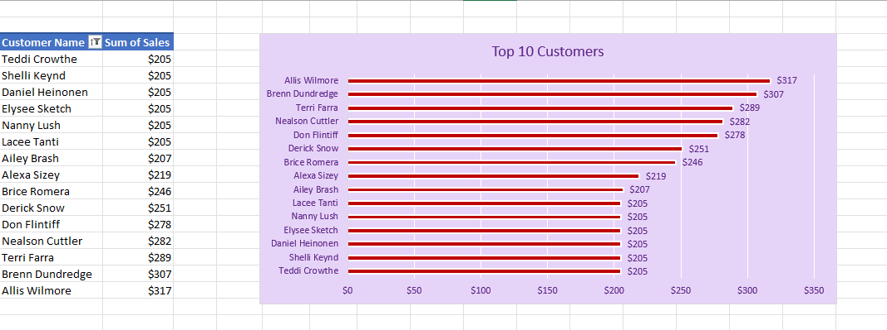
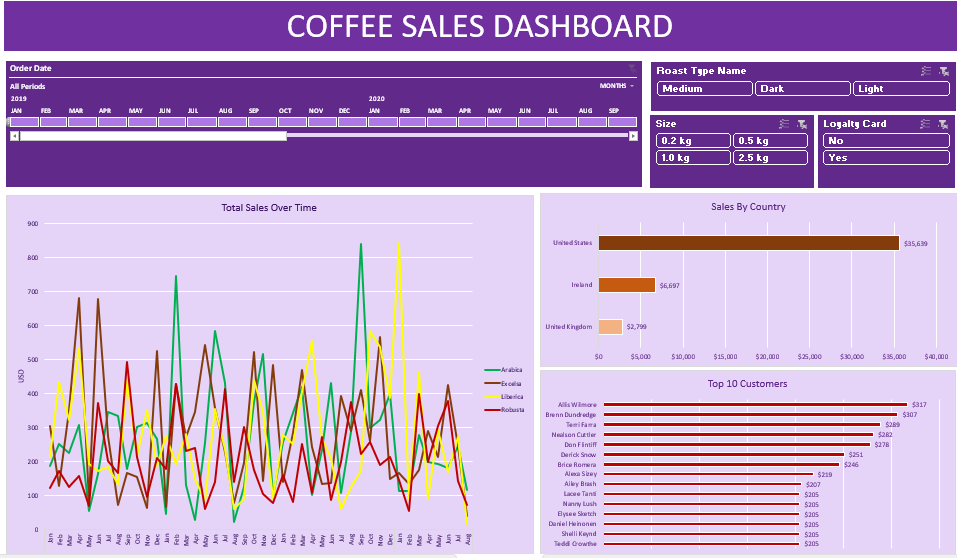

# Coffee_Sales_Analysis

## About This Project

### Project Background

As a coffee enthusiast and data analyst, I embarked on a journey to combine my passion for coffee with my analytical skills. This led to the creation of the Coffee Sales Dashboard, a project aimed at uncovering insights into coffee sales dynamics using Excel. The objective was not just to visualize sales data, but to understand consumer behavior, identify sales trends, and provide actionable recommendations for business growth.

### Project Proposal

I proposed the creation of a dynamic and interactive dashboard to serve as a one-stop solution for analyzing coffee sales data. I aimed to answer pivotal business questions through a data-driven approach that could be beneficial for small coffee shop owners or even larger coffee retail chains.

### Business Questions

The dashboard was designed to answer several key business questions:

- What are the sales trends over time, and how do they correlate with different periods and seasons?
  
- Which countries generate the most sales, and where should we focus our marketing efforts?
  
- What is the distribution of sales across different coffee types, roast types, and sizes?
  
- Who are our top customers, and how can we encourage more loyalty?
  
- Does having a loyalty card influence purchasing behavior?

### About the Data Tools Used

In my project, I meticulously gathered and transformed the data using various Excel functions, ensuring to format it properly while removing any inconsistencies, irrelevant, or duplicate information. The analysis is primarily conducted within two Excel files: **coffee_sales_data.xlsx**, containing three spreadsheets named **orders**, **customers**, and **products**, and **coffee_sales_dashboard.xlsx**, which serves as the main file for analysis.

To create this comprehensive dashboard, I leveraged the capabilities of Microsoft Excel, a robust tool for managing and analyzing business data. The following features and functions of Excel were crucial in the development of the dashboard:

**XLOOKUP:** Utilized to efficiently retrieve customer information such as names, emails, countries, and loyalty card status from the **customers** table and incorporate it into the **orders** spreadsheet.

**INDEX MATCH:** Chosen for its dynamic capabilities, this function helped in accurately extracting product details like coffee type, roast type, and size from the **products** table.

**IF Function:** I employed **nested IF functions** to decode abbreviated terms for coffee types and roast names into their full descriptions, enhancing the readability and comprehensiveness of the data.

**Pivot Tables and Pivot Charts:** These powerful features were instrumental in summarizing large datasets and creating interactive charts that dynamically update the data, facilitating an insightful analysis.

### Analysis Process

The analysis involved meticulously:

- Transforming raw data into a structured format suitable for analysis.
  
- Integrating data from **orders**, **customers**, and **products** sheets to create a holistic view.
  
- Engineering an interactive dashboard with the capability to filter through different data points such as time periods, roast types, product sizes, and loyalty card status.

### Insights Gained

Through the dashboard, I derived several key insights:

**Sales Trends:** I observed significant variances in sales across different months, suggesting potential seasonality in coffee purchase patterns.

The observation of fluctuating sales with peaks in a line chart can be attributed to several possible reasons:

- **Seasonal Demand:** Certain times of the year may see increased coffee consumption due to weather conditions. For example, colder months might boost hot coffee sales, while warmer months could see a rise in cold brew or iced coffee purchases.

- **Marketing Campaigns:** Peaks could align with specific marketing initiatives, such as promotional offers, new product launches, or advertising campaigns, that successfully drive customer interest and sales.

- **Holidays and Special Occasions:** Sales peaks might correspond to holidays or special events (e.g., Christmas, National Coffee Day) when people are more inclined to purchase coffee, either for personal consumption or as gifts.

- **Weekend or Payday Effects:** Peaks might also reflect a pattern where sales increase on weekends or around paydays when people are more likely to treat themselves or go out.

- **Social Media Trends:** Sudden spikes could be the result of viral social media trends or influencers promoting specific coffee drinks, leading to temporary surges in demand.

- **Limited-Time Offers:** The introduction of limited-time offers or seasonal specialties can create a sense of urgency among customers, driving up sales during the offer period.

- **Changes in Consumer Behavior:** Shifts in consumer preferences, such as a growing interest in sustainable or specialty coffees, could lead to periodic sales increases as consumers explore new options.

- **Economic Factors:** Economic upturns or downturns can influence discretionary spending on items like coffee, with peaks possibly indicating periods of economic confidence. When the economy is doing well or not so well, it can affect how much people are willing to spend on extras like coffee. High sales might show times when people feel more comfortable spending money.

**Market Distribution:** The United States emerged as the dominant market, which indicates a targeted area for further marketing efforts.

**Top 10 Customers:** Identifying the top customers allows for targeted marketing and personalized customer engagement strategies.

**Customer Loyalty:** There was a clear indication that loyalty card holders might be spending more, highlighting the effectiveness of customer retention strategies.

### Challenges and Solutions

Throughout this project, I encountered a few challenges, particularly with data cleaning and ensuring the accuracy of the XLOOKUP and INDEX MATCH functions due to incomplete data entries. By implementing rigorous data validation and error-checking routines, I was able to maintain the integrity of the analysis.

### Recommendations

Based on the valuable insights derived from the dashboard analysis, I propose the following strategic recommendations to enhance business outcomes:

**1. Seasonal Campaigns:**

- Strategic Timing: Identify and leverage the peak sales months pinpointed in the sales trends to schedule marketing campaigns. This ensures that promotional efforts align with times of high consumer interest, potentially maximizing revenue.

- Tailored Promotions: Develop promotions and offers that resonate with seasonal preferences, such as special winter blends or summer iced coffee deals, to attract more customers during these peak periods.
  
**2. Focus on Core Markets:**

- Market Prioritization: Direct a greater portion of marketing and customer engagement resources toward the countries and regions that demonstrate the highest sales volumes. This targeted approach can lead to more efficient use of marketing budgets and higher returns on investment.

- Localized Strategies: Implement marketing strategies that cater to the specific tastes and preferences of consumers in these top-performing markets, potentially including local flavor profiles or culturally relevant promotions.

**3. Loyalty Program Enhancement:**

- Value Addition: Reevaluate the loyalty program offerings based on customer feedback and purchase data to introduce more appealing rewards and benefits that encourage repeat business.
  
- Personalized Engagement: Utilize the data from loyalty cards to offer personalized promotions, rewards, and communication to loyalty program members, fostering a sense of value and appreciation among the most loyal customers.
  
**4. Product Optimization:**

- Data-Driven Inventory: Regularly review and analyze customer preferences for different roast types and sizes, adjusting inventory levels to ensure that the most popular items are always available, thereby reducing stockouts and excess inventory.
  
- Product Development: Consider introducing new products or variations based on the observed preferences and trends. This could include exploring new roast profiles, flavors, or size options that have the potential to attract a broader customer base or satisfy emerging market demands.

By implementing these recommendations, the business can not only improve its current performance but also set a solid foundation for sustained growth and customer satisfaction in the competitive coffee market.

### Conclusion

The **Coffee Sales Analysis** project is a personal venture that exemplifies the synergy between my love for coffee and my skillset in data analysis. It is a practical demonstration of how data can tell a compelling story and shape business strategy. This project not only serves as a learning experience but also as a potential blueprint for data-driven decision-making in the coffee industry.
